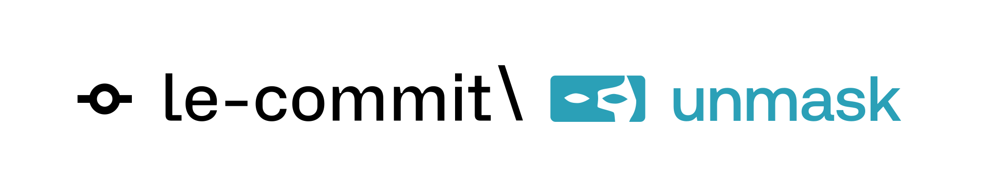

<div align="center">
  
</div>

# Unmask - AI-Powered Hiring Verification Platform

**Trust your hiring process again.**

Unmask is an intelligent hiring verification platform that helps you verify candidate authenticity through comprehensive analysis of CVs, LinkedIn profiles, GitHub accounts, and automated reference calls. Built for **RAISE YOUR HACK 2025** • Vultr Track.

🌐 **Live Demo**: [unmask.click](http://unmask.click/)

---

## ✨ Features

### 🔍 **Multi-Source Profile Analysis**
- **CV Processing**: Extracts and analyzes professional experience, education, skills, and credentials
- **LinkedIn Integration**: Cross-references LinkedIn data with CV information for consistency
- **GitHub Analysis**: Evaluates coding activity, repository quality, and technical skills
- **Credibility Scoring**: AI-powered authenticity assessment with detailed flags and recommendations

### 📞 **Automated Reference Calling**
- **AI-Powered Calls**: Automatically calls references using ElevenLabs Conversational AI
- **Natural Conversations**: Professional, human-like interactions with references
- **Transcript Analysis**: Real-time transcription and AI-powered summarization
- **Reference Validation**: Cross-checks reference feedback with candidate claims

### 🎯 **Real-Time Interview Support**
- **Live Feedback**: Get real-time prompts during candidate interviews
- **Inconsistency Detection**: Flags discrepancies between sources on-the-fly
- **Suggested Questions**: AI-generated follow-up questions based on analysis
- **Interview Transcripts**: Live transcription with highlighted concerns

### 📊 **Comprehensive Dashboard**
- **Candidate Profiles**: Unified view of all candidate information
- **Processing Pipeline**: Real-time status tracking from upload to analysis
- **Flag Management**: Visual indicators for potential concerns
- **Export Reports**: Detailed hiring decision support documents

---

## 🛠️ Technology Stack

### **Frontend**
- **Next.js 15** - React framework with App Router
- **TypeScript** - Type-safe development
- **Tailwind CSS** - Modern styling framework
- **Radix UI** - Accessible component primitives
- **Framer Motion** - Smooth animations

### **Backend & Storage**
- **Supabase** - PostgreSQL database with real-time capabilities
- **Supabase Storage** - Secure file storage for CVs and documents
- **Ashby ATS Integration** - Seamless candidate import and sync

### **AI & Analysis**
- **Groq API** - Fast AI inference for document analysis
- **OpenAI GPT-4** - Advanced reasoning and summarization
- **ElevenLabs** - Natural voice AI for reference calls
- **PDF Processing** - Automated document parsing and extraction

### **Infrastructure**
- **Docker** - Containerized deployment
- **Vultr** - Cloud hosting platform
- **Real-time Processing** - Async job processing

---

## 🚀 Quick Start

### **Prerequisites**
- Node.js 18+
- Docker (for production deployment)
- API keys for external services

### **Development Setup**

1. **Clone the repository**
   ```bash
   git clone https://github.com/le-commit/unmask.git
   cd unmask
   ```

2. **Install dependencies**
   ```bash
   cd frontend
   npm install
   ```

3. **Configure environment variables**
   ```bash
   cp .env.example .env.local
   ```

   Required environment variables:
   ```env
   # Supabase
   NEXT_PUBLIC_SUPABASE_URL=your_supabase_url
   NEXT_PUBLIC_SUPABASE_ANON_KEY=your_anon_key
   SUPABASE_SERVICE_ROLE_KEY=your_service_role_key

   # AI Services
   GROQ_API_KEY=your_groq_api_key
   OPENAI_API_KEY=your_openai_api_key

   # Reference Calling (ElevenLabs)
   ELEVENLABS_API_KEY=your_elevenlabs_api_key
   ELEVENLABS_AGENT_ID=your_agent_id
   ELEVENLABS_AGENT_PHONE_ID=your_phone_id

   # Twilio (via ElevenLabs)
   TWILIO_ACCOUNT_SID=your_twilio_sid
   TWILIO_AUTH_TOKEN=your_twilio_token
   TWILIO_PHONE_NUMBER=your_twilio_number

   # Ashby ATS Integration
   ASHBY_API_KEY=your_ashby_api_key
   ```

4. **Start development server**
   ```bash
   npm run dev
   ```

5. **Open your browser**
   ```
   http://localhost:3000
   ```

---

## 🌐 Production Deployment

### **Vultr Deployment (Recommended)**

We provide automated deployment scripts for seamless production deployment:

1. **Make scripts executable**
   ```bash
   chmod +x deploy.sh rollback.sh check-status.sh
   ```

2. **Deploy to production**
   ```bash
   ./deploy.sh
   ```

3. **Check deployment status**
   ```bash
   ./check-status.sh
   ```

4. **Emergency rollback** (if needed)
   ```bash
   ./rollback.sh
   ```

### **Docker Deployment**

1. **Build the Docker image**
   ```bash
   docker build -t unmask:latest .
   ```

2. **Run the container**
   ```bash
   docker run -d \
     --name unmask-app \
     -p 3000:3000 \
     --env-file .env.local \
     unmask:latest
   ```

### **Manual Deployment**

1. **Build the application**
   ```bash
   cd frontend
   npm run build
   ```

2. **Start production server**
   ```bash
   npm start
   ```

---

## 🔌 API Endpoints

### **Applicant Management**
- `GET /api/applicants` - List all applicants
- `POST /api/applicants` - Create new applicant with CV/LinkedIn/GitHub
- `GET /api/applicants/[id]` - Get specific applicant
- `PUT /api/applicants/[id]` - Update applicant information
- `DELETE /api/applicants/[id]` - Delete applicant

### **Ashby ATS Integration**
- `GET /api/ashby/candidates` - List and sync candidates from Ashby
- `POST /api/ashby/candidates` - Force refresh all candidates
- `POST /api/ashby/store-cv` - Download and store CV in Supabase Storage

### **Reference Calling**
- `POST /api/reference-call` - Initiate automated reference call
- `GET /api/get-transcript?conversationId=` - Retrieve call transcript
- `POST /api/summarize-transcript` - AI analysis of reference call

### **Processing Pipeline**
- File upload → CV/LinkedIn parsing → GitHub analysis → AI credibility assessment → Reference verification

---

## 📖 Usage Guide

### **Adding a New Candidate**

1. **Navigate to the dashboard**: `/board`
2. **Click "Add New Applicant"**
3. **Upload required documents**:
   - CV (PDF, DOC, DOCX) - **Required**
   - LinkedIn Profile (PDF, HTML, TXT) - *Optional*
   - GitHub Profile URL - *Optional*
4. **Submit and wait for processing**

### **Automated Reference Calling**

1. **Open the reference call interface**: `/call`
2. **Fill in reference details**:
   - Phone number (with country code)
   - Candidate name
   - Reference name
   - Company context (optional)
   - Role and duration (optional)
3. **Initiate the call**
4. **Review transcript and AI summary**

### **Interview Support**

1. **Navigate to candidate profile**
2. **Click "Start Interview"**
3. **Use real-time suggestions** during the call
4. **Review flagged inconsistencies**

---

## 🔧 Configuration

### **AI Model Configuration**
- **Primary Analysis**: Groq Llama models for speed
- **Summarization**: GPT-4o-mini for cost efficiency
- **Voice AI**: ElevenLabs for natural conversations

### **Processing Limits**
- **GitHub Repositories**: 50 per analysis
- **Content Analysis**: 3 repositories max
- **File Size**: 10MB per document
- **Concurrent Processing**: 3 applicants

### **Security Features**
- Environment variable validation
- File type restrictions
- Input sanitization
- Rate limiting on API endpoints

---

## 🚨 Troubleshooting

### **Common Issues**

**"Permission denied" when running deployment scripts**
```bash
chmod +x deploy.sh rollback.sh check-status.sh
```

**CV processing fails**
- Ensure PDF is not password protected
- Check file size is under 10MB
- Verify GROQ_API_KEY is set correctly

**Reference calls not working**
- Verify ElevenLabs agent is configured
- Check Twilio phone number permissions
- Ensure all environment variables are set

**Docker deployment issues**
```bash
# Check logs
docker logs unmask-app

# Restart container
docker restart unmask-app

# Check environment variables
docker exec unmask-app env | sort
```

---

## 🤝 Contributing

We welcome contributions! Please see our [development guide](docs/) for:
- Code style guidelines
- Testing procedures
- Feature request process
- Bug reporting

---

## 📚 Documentation

- [Deployment Scripts Guide](docs/DEPLOYMENT_SCRIPTS.md)
- [Supabase Storage Setup](docs/SUPABASE_STORAGE_SETUP.md)
- [Reference Calling Setup](docs/REFERENCE_CALLING_FEATURE.md)
- [Vultr Deployment Guide](docs/VULTR_DEPLOYMENT.md)
- [API Documentation](docs/SETUP_GUIDE_CALLING.md)

---

## 📄 License

This project is built for **RAISE YOUR HACK 2025** hackathon submission.

---

## 🏆 Hackathon Details

**Event**: RAISE YOUR HACK 2025
**Track**: Vultr Infrastructure Challenge
**Team**: le-commit
**Live Demo**: [unmask.click](http://unmask.click/)

---


<div align="center">
  <p>Built with ❤️ by the le-commit team</p>
  <p>
    <a href="https://github.com/le-commit" target="_blank">GitHub</a> •
    <a href="http://unmask.click/" target="_blank">Live Demo</a>
  </p>
</div>
