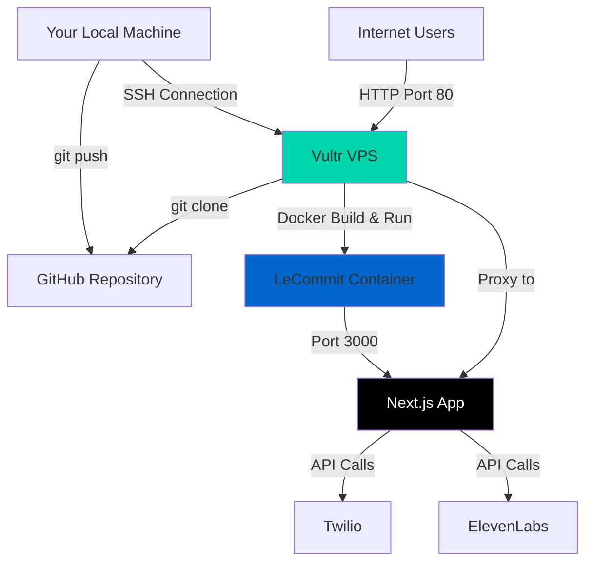
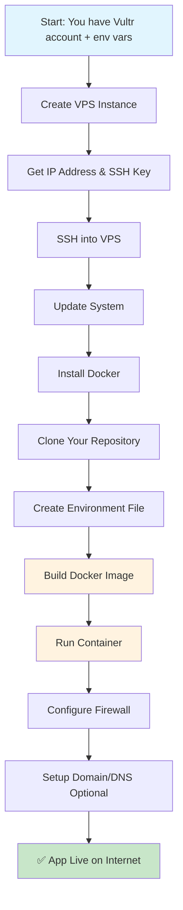
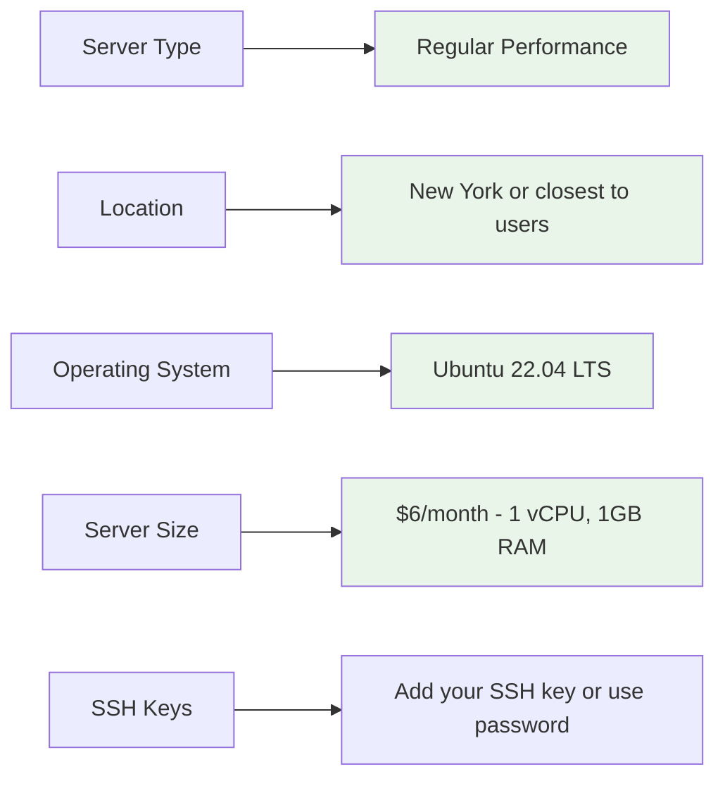
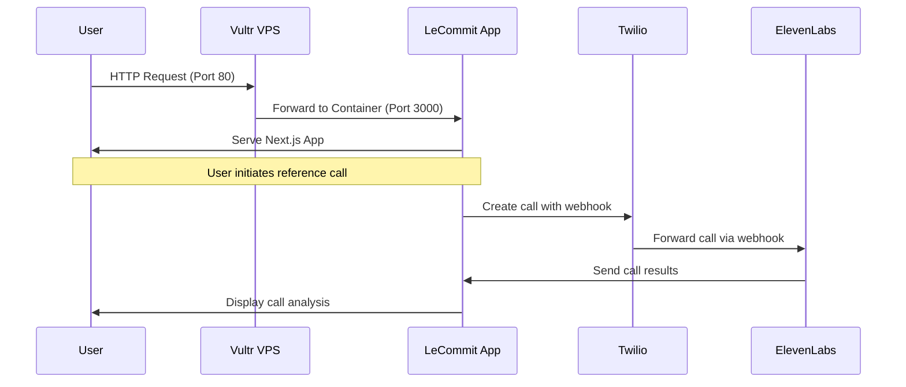

# VPS Vultr Deployment Guide for LeCommit

Complete guide to deploy your LeCommit reference calling app on a Vultr VPS.

## Architecture Overview



## Deployment Process Flow



## Prerequisites Checklist

- ✅ Vultr account created
- ✅ Environment variables ready
- ✅ GitHub repository with your code
- ✅ SSH client (Terminal on Mac/Linux, PuTTY on Windows)

## Step 1: Create Your Vultr VPS

### 1.1 Deploy New Instance

1. Log into [Vultr Dashboard](https://my.vultr.com/)
2. Click **"Deploy New Instance"**
3. Choose **"Cloud Compute - Shared CPU"**

### 1.2 Configuration Settings



**Recommended Settings:**
- **Server Type**: Regular Performance  
- **Location**: New York (ewr) or closest to your target users
- **Operating System**: Ubuntu 22.04 LTS x64
- **Server Size**: $6/month (25 GB SSD, 1 vCPU, 1024 MB Memory)
- **SSH Keys**: Add your public key (recommended) or use password

### 1.3 Deploy and Wait

- Click **"Deploy Now"**
- Wait 2-3 minutes for provisioning
- Note the **IP address** when ready

## Step 2: Connect to Your VPS

### 2.1 SSH Connection

```bash
# Replace YOUR_IP with your actual VPS IP address
ssh root@YOUR_IP

# If using SSH key, it should connect automatically
# If using password, enter the password from Vultr dashboard
```

### 2.2 First Login Setup

```bash
# Update the system
apt update && apt upgrade -y

# Install essential tools
apt install -y curl wget git ufw
```

## Step 3: Install Docker

```bash
# Install Docker using the official script
curl -fsSL https://get.docker.com -o get-docker.sh
sh get-docker.sh

# Start Docker service
systemctl start docker
systemctl enable docker

# Verify installation
docker --version
```

## Step 4: Deploy Your Application

### 4.1 Clone Repository

```bash
# Clone your repository (replace with your GitHub username/repo)
git clone https://github.com/YOUR_USERNAME/le-commit.git
cd le-commit

# Switch to your cleanup branch if needed
git checkout cleanup-for-deployment
```

### 4.2 Create Environment File

```bash
# Create the environment file
nano frontend/.env.local
```

**Add your environment variables:**
```env
NEXT_PUBLIC_APP_URL=http://YOUR_VPS_IP
NEXT_PUBLIC_APP_ENV=production
TWILIO_ACCOUNT_SID=your_actual_sid
TWILIO_AUTH_TOKEN=your_actual_token
TWILIO_PHONE_NUMBER=your_actual_number
ELEVENLABS_API_KEY=your_actual_key
ELEVENLABS_VOICE_ID=your_actual_voice_id
ELEVENLABS_AGENT_ID=your_actual_agent_id
ELEVENLABS_AGENT_PHONE_ID=your_actual_phone_id
```

**Save and exit:** `Ctrl+X`, then `Y`, then `Enter`

### 4.3 Build and Run

```bash
# Build the Docker image
docker build -t lecommit .

# Run the container
docker run -d \
  --name lecommit-app \
  --restart unless-stopped \
  -p 80:3000 \
  --env-file frontend/.env.local \
  lecommit

# Check if it's running
docker ps
```

## Step 5: Configure Firewall

```bash
# Enable UFW firewall
ufw enable

# Allow SSH (important - don't lock yourself out!)
ufw allow ssh

# Allow HTTP traffic
ufw allow 80

# Allow HTTPS traffic (for future SSL setup)
ufw allow 443

# Check firewall status
ufw status
```

## Step 6: Verify Deployment

### 6.1 Check Container Status

```bash
# Check if container is running
docker ps

# Check container logs
docker logs lecommit-app

# If you need to restart
docker restart lecommit-app
```

### 6.2 Test Your App

```bash
# Test locally on the VPS
curl http://localhost

# From your local machine, visit:
# http://YOUR_VPS_IP
```

## Application Flow Diagram



## Troubleshooting

### Common Issues

**Container won't start:**
```bash
# Check logs for errors
docker logs lecommit-app

# Check if port is in use
netstat -tlnp | grep :80
```

**Can't access from internet:**
```bash
# Check firewall
ufw status

# Check if container is running
docker ps

# Check if app is responding locally
curl http://localhost
```

**Environment variables not working:**
```bash
# Check if env file exists
ls -la frontend/.env.local

# Restart container with verbose logging
docker stop lecommit-app
docker rm lecommit-app
docker run -d \
  --name lecommit-app \
  --restart unless-stopped \
  -p 80:3000 \
  --env-file frontend/.env.local \
  lecommit
```

## Cost & Maintenance

### Monthly Costs
- **VPS**: $6/month (1GB RAM, 1 vCPU)
- **Bandwidth**: 1TB included
- **Twilio**: Pay per call (~$0.01-0.04 per minute)
- **ElevenLabs**: Pay per API call

### Maintenance Tasks

```bash
# Weekly: Update system packages
apt update && apt upgrade -y

# Monthly: Check disk space
df -h

# As needed: View application logs
docker logs lecommit-app --tail 100

# Backup: Create snapshot in Vultr dashboard
```

## Optional: Domain Setup

If you want a custom domain instead of IP address:

1. **Buy domain** (Namecheap, GoDaddy, etc.)
2. **Add A record** pointing to your VPS IP
3. **Install SSL** with Let's Encrypt:

```bash
# Install certbot
apt install certbot

# Get SSL certificate (replace yourdomain.com)
certbot certonly --standalone -d yourdomain.com

# Update Docker run command to include SSL
# (This requires nginx setup - let me know if you want this guide)
```

## Success! 🎉

Your LeCommit app should now be live at `http://YOUR_VPS_IP`

**What you've accomplished:**
- ✅ Deployed a production Next.js app
- ✅ Set up Docker containerization
- ✅ Configured proper firewall security
- ✅ Connected to Twilio and ElevenLabs APIs
- ✅ Created a scalable infrastructure

**Next steps you might consider:**
- Add a custom domain
- Set up SSL/HTTPS
- Configure automated backups
- Add monitoring/logging
- Scale up server resources as needed 