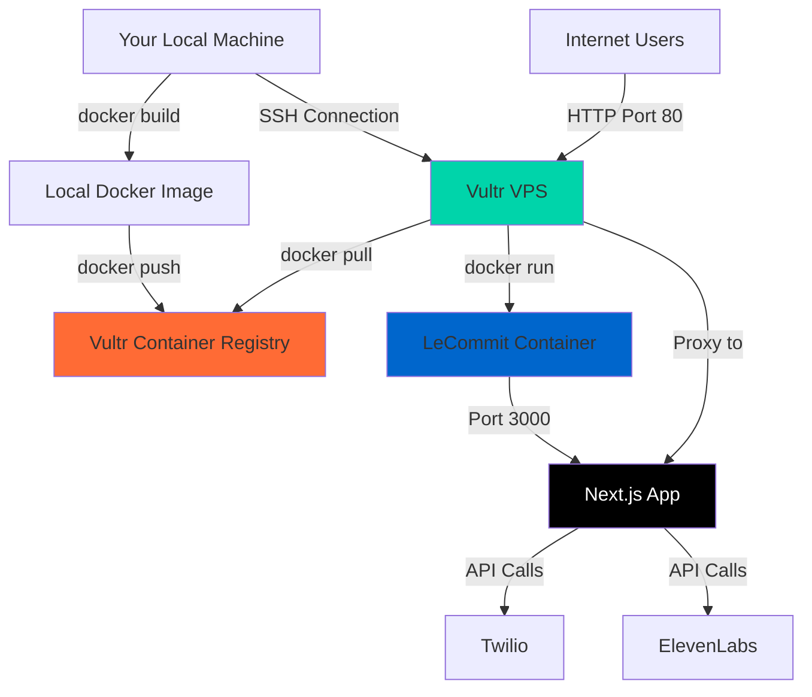

# VPS Vultr Deployment Guide for LeCommit

Complete guide to deploy your LeCommit reference calling app on a Vultr VPS.

## Deployment Strategy: Container Registry (Recommended)

Using Vultr Container Registry is the **preferred method** because:
- ✅ Faster VPS deployment (no building on server)
- ✅ Consistent environments (build once, deploy anywhere)
- ✅ Easier rollbacks and version management
- ✅ Better for CI/CD pipelines

## Updated Architecture with Container Registry



## Updated Process Flow

```mermaid
flowchart TD
    A[Start: You have Vultr account + env vars] --> B[Create Container Registry]
    B --> C[Build & Push Container Locally]
    C --> D[Create VPS Instance]
    D --> E[SSH into VPS]
    E --> F[Install Docker]
    F --> G[Login to Container Registry]
    G --> H[Pull Your Container]
    H --> I[Run Container with Env Vars]
    I --> J[Configure Firewall]
    J --> K[✅ App Live on Internet]
    
    style A fill:#e1f5fe
    style B fill:#fff3e0
    style C fill:#fff3e0
    style K fill:#c8e6c9
```



## Prerequisites Checklist

- ✅ Vultr account created
- ✅ Environment variables ready
- ✅ Docker installed locally
- ✅ Vultr Container Registry created (you have this!)

## Step 1: Build and Push Container (Local Machine)

### 1.1 Login to Vultr Container Registry

```bash
# Login to your Vultr Container Registry
docker login https://lhr.vultrcr.com/lecommit1 \
  -u 02a85eb8-61b3-4916-b8c4-d4b8d879244c \
  -p gZ4DubSBGb4d9Qwskyi6mHe2GbEfzanJmQey
```

### 1.2 Build and Push Your Container

```bash
# Make sure you're in your le-commit directory
cd /Users/henryallen/le-commit

# Build the Docker image
docker build -t lhr.vultrcr.com/lecommit1/lecommit:latest .

# Push to Vultr Container Registry
docker push lhr.vultrcr.com/lecommit1/lecommit:latest
```

## Step 2: Create Your Vultr VPS

### 2.1 Deploy New Instance

1. Log into [Vultr Dashboard](https://my.vultr.com/)
2. Click **"Deploy New Instance"**
3. Choose **"Cloud Compute - Shared CPU"**

### 2.2 Configuration Settings


**Recommended Settings:**
- **Server Type**: Regular Performance  
- **Location**: New York (ewr) or closest to your target users
- **Operating System**: Ubuntu 22.04 LTS x64
- **Server Size**: $6/month (25 GB SSD, 1 vCPU, 1024 MB Memory)
- **SSH Keys**: Add your public key (recommended) or use password

### 2.3 Deploy and Wait

- Click **"Deploy Now"**
- Wait 2-3 minutes for provisioning
- Note the **IP address** when ready

## Step 3: Connect to Your VPS

### 3.1 SSH Connection

```bash
# Replace YOUR_IP with your actual VPS IP address
ssh root@YOUR_IP

# If using SSH key, it should connect automatically
# If using password, enter the password from Vultr dashboard
```

### 3.2 First Login Setup

```bash
# Update the system
apt update && apt upgrade -y

# Install essential tools
apt install -y curl wget git ufw
```

## Step 4: Install Docker on VPS

```bash
# Install Docker using the official script
curl -fsSL https://get.docker.com -o get-docker.sh
sh get-docker.sh

# Start Docker service
systemctl start docker
systemctl enable docker

# Verify installation
docker --version
```

## Step 5: Deploy from Container Registry

### 5.1 Login to Registry on VPS

```bash
# Login to Vultr Container Registry from the VPS
docker login https://lhr.vultrcr.com/lecommit1 \
  -u 02a85eb8-61b3-4916-b8c4-d4b8d879244c \
  -p gZ4DubSBGb4d9Qwskyi6mHe2GbEfzanJmQey
```

### 5.2 Create Environment File

```bash
# Create directory for app config
mkdir -p /opt/lecommit

# Create the environment file
nano /opt/lecommit/.env.local
```

**Add your environment variables:**
```env
NEXT_PUBLIC_APP_URL=http://YOUR_VPS_IP
NEXT_PUBLIC_APP_ENV=production
TWILIO_ACCOUNT_SID=your_actual_sid
TWILIO_AUTH_TOKEN=your_actual_token
TWILIO_PHONE_NUMBER=your_actual_number
ELEVENLABS_API_KEY=your_actual_key
ELEVENLABS_VOICE_ID=your_actual_voice_id
ELEVENLABS_AGENT_ID=your_actual_agent_id
ELEVENLABS_AGENT_PHONE_ID=your_actual_phone_id
```

**Save and exit:** `Ctrl+X`, then `Y`, then `Enter`

### 5.3 Pull and Run Container

```bash
# Pull your container from the registry
docker pull lhr.vultrcr.com/lecommit1/lecommit:latest

# Run the container
docker run -d \
  --name lecommit-app \
  --restart unless-stopped \
  -p 80:3000 \
  --env-file /opt/lecommit/.env.local \
  lhr.vultrcr.com/lecommit1/lecommit:latest

# Check if it's running
docker ps
```

## Step 6: Configure Firewall

```bash
# Enable UFW firewall
ufw enable

# Allow SSH (important - don't lock yourself out!)
ufw allow ssh

# Allow HTTP traffic
ufw allow 80

# Allow HTTPS traffic (for future SSL setup)
ufw allow 443

# Check firewall status
ufw status
```

## Step 7: Verify Deployment

### 7.1 Check Container Status

```bash
# Check if container is running
docker ps

# Check container logs
docker logs lecommit-app

# If you need to restart
docker restart lecommit-app
```

### 7.2 Test Your App

```bash
# Test locally on the VPS
curl http://localhost

# From your local machine, visit:
# http://YOUR_VPS_IP
```

## Benefits of Container Registry Approach

### Faster Updates
```bash
# To update your app (run locally):
docker build -t lhr.vultrcr.com/lecommit1/lecommit:v2 .
docker push lhr.vultrcr.com/lecommit1/lecommit:v2

# Then on VPS:
docker stop lecommit-app
docker rm lecommit-app
docker pull lhr.vultrcr.com/lecommit1/lecommit:v2
docker run -d \
  --name lecommit-app \
  --restart unless-stopped \
  -p 80:3000 \
  --env-file /opt/lecommit/.env.local \
  lhr.vultrcr.com/lecommit1/lecommit:v2
```

### Easy Rollbacks
```bash
# Rollback to previous version
docker stop lecommit-app
docker rm lecommit-app
docker run -d \
  --name lecommit-app \
  --restart unless-stopped \
  -p 80:3000 \
  --env-file /opt/lecommit/.env.local \
  lhr.vultrcr.com/lecommit1/lecommit:latest
```

## Application Flow Diagram


## Troubleshooting

### Common Issues

**Container won't start:**
```bash
# Check logs for errors
docker logs lecommit-app

# Check if port is in use
netstat -tlnp | grep :80
```

**Can't access from internet:**
```bash
# Check firewall
ufw status

# Check if container is running
docker ps

# Check if app is responding locally
curl http://localhost
```

**Environment variables not working:**
```bash
# Check if env file exists
ls -la frontend/.env.local

# Restart container with verbose logging
docker stop lecommit-app
docker rm lecommit-app
docker run -d \
  --name lecommit-app \
  --restart unless-stopped \
  -p 80:3000 \
  --env-file frontend/.env.local \
  lecommit
```

## Cost & Maintenance

### Monthly Costs
- **VPS**: $6/month (1GB RAM, 1 vCPU)
- **Bandwidth**: 1TB included
- **Twilio**: Pay per call (~$0.01-0.04 per minute)
- **ElevenLabs**: Pay per API call

### Maintenance Tasks

```bash
# Weekly: Update system packages
apt update && apt upgrade -y

# Monthly: Check disk space
df -h

# As needed: View application logs
docker logs lecommit-app --tail 100

# Backup: Create snapshot in Vultr dashboard
```

## Optional: Domain Setup

If you want a custom domain instead of IP address:

1. **Buy domain** (Namecheap, GoDaddy, etc.)
2. **Add A record** pointing to your VPS IP
3. **Install SSL** with Let's Encrypt:

```bash
# Install certbot
apt install certbot

# Get SSL certificate (replace yourdomain.com)
certbot certonly --standalone -d yourdomain.com

# Update Docker run command to include SSL
# (This requires nginx setup - let me know if you want this guide)
```

## Success! 🎉

Your LeCommit app should now be live at `http://YOUR_VPS_IP`

**What you've accomplished:**
- ✅ Deployed a production Next.js app
- ✅ Set up Docker containerization
- ✅ Configured proper firewall security
- ✅ Connected to Twilio and ElevenLabs APIs
- ✅ Created a scalable infrastructure

**Next steps you might consider:**
- Add a custom domain
- Set up SSL/HTTPS
- Configure automated backups
- Add monitoring/logging
- Scale up server resources as needed 