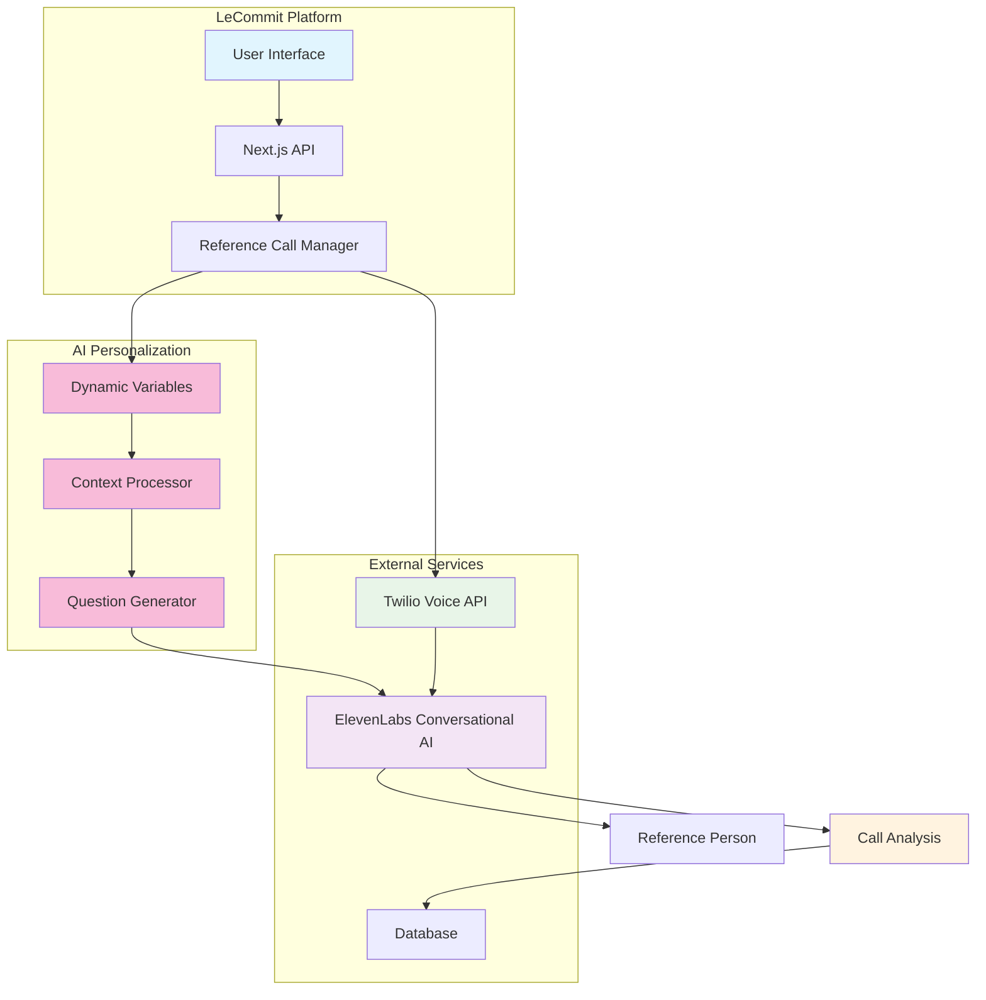
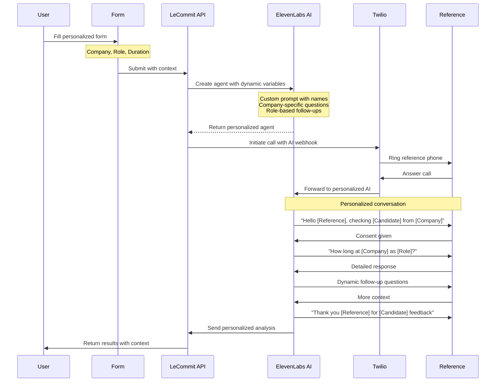
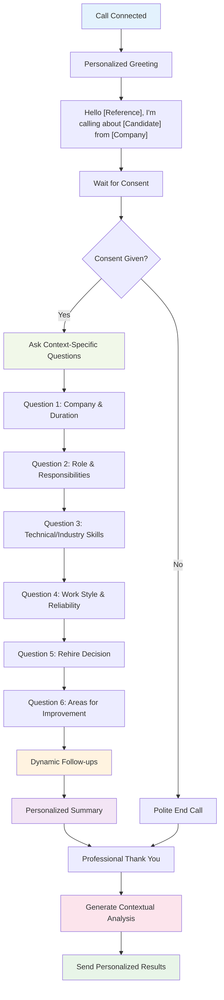
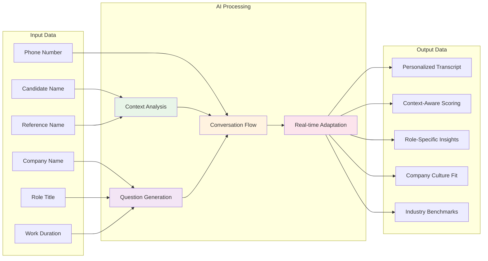
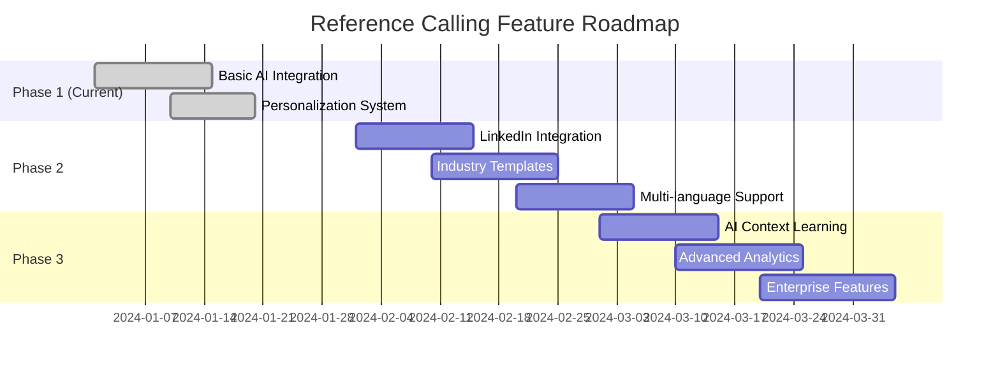

# 📞 Reference Calling Feature

**LeCommit's AI-Powered Reference Validation System**

This document explains how our automated reference calling feature works using **ElevenLabs Conversational AI** and **Twilio Voice**.

---

## 🎯 Overview

The Reference Calling feature automatically calls candidate references and conducts professional interviews using AI to validate their background and experience. This system eliminates manual reference checking while providing detailed analysis and credibility scoring.

### ✨ Key Benefits
- **Automated**: No manual calling required
- **Personalized**: AI adapts questions based on context
- **Professional**: AI conducts natural, professional conversations
- **Scalable**: Handle multiple reference checks simultaneously
- **Consistent**: Same question framework, personalized execution
- **Analyzed**: AI provides instant analysis and scoring

---

## 🎭 **AI Personalization & Control**

### 💎 **Full Control Over Questions & Scripts**

**YES!** You have complete control over the AI agent's conversation. Here's how:

#### 🎯 **Dynamic Variables System**
```typescript
// Example: Personalized agent creation
const dynamicVariables = {
  candidate_name: "John Doe",
  reference_name: "Jane Smith", 
  company_name: "TechCorp Inc",
  role_title: "Senior Software Engineer",
  work_duration: "2 years"
};
```

#### 🗣️ **Context-Aware Questions**
The AI adapts questions based on provided context:

| Context Provided | AI Question Examples |
|------------------|---------------------|
| **Company Name** | "How long did you work with [Candidate] at [Company]?" |
| **Role Title** | "What were [Candidate]'s responsibilities as [Role]?" |
| **Work Duration** | "Can you confirm [Candidate] worked for [Duration]?" |
| **Industry** | "How did [Candidate] handle [industry-specific challenges]?" |

#### 🎪 **Conversation Flow Control**
```typescript
// Example: Custom prompt with variables
const agentPrompt = `
You are conducting a reference check for ${candidateName}.
Speaking with ${referenceName} from ${companyName}.

PERSONALIZED GREETING:
"Hello ${referenceName}, I'm calling about ${candidateName} 
who worked with you at ${companyName} as a ${roleTitle}."

DYNAMIC QUESTIONS:
1. Company Context: "How was ${candidateName}'s performance at ${companyName}?"
2. Role Specific: "As a ${roleTitle}, what were ${candidateName}'s key strengths?"
3. Timeline: "During those ${workDuration}, what growth did you see?"

FOLLOW-UP LOGIC:
- If positive → "What made ${candidateName} stand out?"
- If concerns → "Can you elaborate on those challenges?"
- If technical → "How were ${candidateName}'s technical skills?"
`;
```

### 📊 **Personalization Examples**

#### **Example 1: Tech Startup Context**
```json
{
  "candidateName": "Alex Chen",
  "referenceName": "Sarah Johnson", 
  "companyName": "StartupXYZ",
  "roleTitle": "Full Stack Developer",
  "workDuration": "18 months"
}
```

**AI Questions:**
- "Hi Sarah, I'm calling about Alex Chen who worked as a Full Stack Developer at StartupXYZ"
- "During those 18 months, how did Alex handle the fast-paced startup environment?"
- "What specific technologies did Alex work with at StartupXYZ?"

#### **Example 2: Corporate Enterprise Context**
```json
{
  "candidateName": "Michael Rodriguez",
  "referenceName": "David Kim",
  "companyName": "Fortune 500 Corp", 
  "roleTitle": "Senior Project Manager",
  "workDuration": "3 years"
}
```

**AI Questions:**
- "Hello David, I'm calling about Michael Rodriguez from Fortune 500 Corp"
- "As a Senior Project Manager for 3 years, how did Michael handle large-scale projects?"
- "How did Michael navigate corporate processes and stakeholder management?"

### 🎨 **Advanced Customization Features**

#### **🌟 Industry-Specific Adaptations**
```typescript
// AI automatically adapts tone and questions based on context
const industryAdaptations = {
  "Healthcare": "HIPAA compliance, patient care focus",
  "Finance": "Regulatory awareness, attention to detail", 
  "Tech": "Innovation, technical problem-solving",
  "Education": "Student outcomes, collaboration skills"
};
```

#### **🎭 Role-Based Question Sets**
```typescript
// Different question focuses based on role
const roleQuestions = {
  "Software Engineer": [
    "Code quality and best practices",
    "Technical problem-solving approach", 
    "Collaboration on development teams"
  ],
  "Sales Manager": [
    "Team leadership and motivation",
    "Sales target achievement",
    "Customer relationship management"
  ],
  "Marketing Director": [
    "Campaign strategy and execution",
    "Brand management skills",
    "Cross-functional collaboration"
  ]
};
```

#### **📈 Experience-Level Adjustments**
```typescript
// AI adjusts expectations based on experience level
const experienceContext = {
  "Junior (0-2 years)": "Growth potential, learning ability",
  "Mid-level (2-5 years)": "Independent work, project ownership",
  "Senior (5+ years)": "Leadership, strategic thinking",
  "Executive": "Vision, organizational impact"
};
```

---

## 🏗️ Architecture Overview



---

## 🔄 Personalized Call Flow



---

## 🎤 AI Conversation Flow



---

## 🛠️ Technical Implementation

### 1. **API Endpoint** (`/api/reference-call`)

**Purpose**: Orchestrates the entire reference calling process with personalization

**Enhanced Process**:
1. Receives candidate and reference details + context
2. Creates personalized ElevenLabs AI agent with dynamic variables
3. Generates context-aware conversation prompts
4. Initiates Twilio call with personalized AI webhook
5. Returns call tracking information

```typescript
// Enhanced flow with personalization
const agentResponse = await createReferenceCheckAgent(
  candidateName, 
  referenceName, 
  companyName,    // 🎯 Company context
  roleTitle,      // 🎯 Role-specific questions
  workDuration    // 🎯 Timeline validation
);

const call = await twilioClient.calls.create({
  to: phoneNumber,
  from: process.env.TWILIO_PHONE_NUMBER,
  url: agentResponse.webhookUrl, // 🎯 Personalized AI agent
});
```

### 2. **Dynamic AI Agent Configuration**

**ElevenLabs Conversational AI** is configured with:
- **Personalized prompts** with candidate/reference names
- **Context-aware questions** based on company/role
- **Industry-specific conversation guidelines**
- **Dynamic follow-up logic** based on responses
- **Professional tone** matching the business context

### 3. **Enhanced Results Processing**

**Purpose**: Receives and processes context-aware AI analysis

**Personalized Analysis Includes**:
- **Context-specific insights** (company culture fit, role performance)
- **Industry-relevant scoring** (technical vs. soft skills weighting)
- **Experience-level expectations** (junior vs. senior assessments)
- **Company-specific red flags** (startup vs. enterprise concerns)
- **Role-specific competencies** (technical vs. leadership focus)

---

## 📊 Data Flow



---

## 🎯 Personalization Examples

### **Example 1: Startup Software Developer**
```json
{
  "context": {
    "candidateName": "Emma Wilson",
    "referenceName": "Jake Martinez",
    "companyName": "TechStartup Inc",
    "roleTitle": "Frontend Developer", 
    "workDuration": "14 months"
  },
  "aiQuestions": [
    "Hi Jake, I'm calling about Emma Wilson who worked as a Frontend Developer at TechStartup Inc for 14 months",
    "How did Emma handle the fast-paced startup environment?",
    "What frontend technologies did Emma work with?",
    "How did Emma collaborate with the small development team?",
    "Did Emma take on responsibilities beyond frontend development?"
  ]
}
```

### **Example 2: Enterprise Project Manager**
```json
{
  "context": {
    "candidateName": "Robert Chen",
    "referenceName": "Lisa Davis",
    "companyName": "Global Corp",
    "roleTitle": "Senior Project Manager",
    "workDuration": "3 years"
  },
  "aiQuestions": [
    "Hello Lisa, I'm calling about Robert Chen who worked as a Senior Project Manager at Global Corp for 3 years",
    "How did Robert manage large-scale enterprise projects?",
    "What was Robert's approach to stakeholder management?",
    "How did Robert handle budget and timeline pressures?",
    "Did Robert mentor junior project managers?"
  ]
}
```

### **Example 3: Healthcare Professional**
```json
{
  "context": {
    "candidateName": "Dr. Sarah Johnson",
    "referenceName": "Dr. Michael Brown",
    "companyName": "Metro Hospital",
    "roleTitle": "Emergency Medicine Physician",
    "workDuration": "2 years"
  },
  "aiQuestions": [
    "Hi Dr. Brown, I'm calling about Dr. Sarah Johnson who worked in Emergency Medicine at Metro Hospital for 2 years",
    "How did Dr. Johnson handle high-pressure emergency situations?",
    "What was Dr. Johnson's approach to patient care?",
    "How did Dr. Johnson collaborate with nursing staff?",
    "Did Dr. Johnson maintain composure during critical cases?"
  ]
}
```

---

## 🔧 Environment Configuration

### Required Variables

```env
# Twilio (Phone Calls)
TWILIO_ACCOUNT_SID=your_twilio_account_sid
TWILIO_AUTH_TOKEN=your_twilio_auth_token
TWILIO_PHONE_NUMBER=your_twilio_phone_number

# ElevenLabs (AI Agent)
ELEVENLABS_API_KEY=your_elevenlabs_api_key
ELEVENLABS_VOICE_ID=your_elevenlabs_voice_id

# Application
NEXT_PUBLIC_APP_URL=http://localhost:3000
```

### Setup Steps

1. **Twilio Setup**:
   - Create account at [console.twilio.com](https://console.twilio.com)
   - Get Account SID & Auth Token
   - Purchase phone number

2. **ElevenLabs Setup**:
   - Create account at [elevenlabs.io](https://elevenlabs.io)
   - Get API key
   - Choose voice for AI agent

---

## 🎯 Features & Capabilities

### ✅ **What It Does**

- **Personalized Calling**: AI uses actual names and context throughout
- **Context-Aware Questions**: Adapts to company, role, and industry
- **Dynamic Follow-ups**: AI responds intelligently to reference answers
- **Professional Tone**: Matches business context and industry standards
- **Complete Personalization**: Every call is uniquely tailored

### ✨ **Advanced Features**

- **Industry Adaptation**: Questions adapt to healthcare, tech, finance, etc.
- **Role-Specific Focus**: Technical vs. management vs. sales emphasis
- **Experience Level Awareness**: Different expectations for junior vs. senior
- **Company Culture Context**: Startup vs. enterprise conversation style
- **Timeline Validation**: Confirms work duration and dates

### ❌ **Current Limitations**

- **Demo Mode**: Currently simulates ElevenLabs integration
- **Basic Analysis**: Keyword-based sentiment analysis
- **English Only**: Currently optimized for English conversations
- **Form-Based Context**: Manual entry of personalization details

---

## 🔮 Future Enhancements

### Phase 2 Roadmap



### Planned Features

- **LinkedIn Integration**: Auto-populate context from LinkedIn profiles
- **Industry Templates**: Pre-built question sets for different industries
- **AI Context Learning**: AI learns from past calls to improve personalization
- **Advanced Analytics**: Industry benchmarking and role-specific insights
- **Multi-language**: Support for global reference checking

---

## 🧪 Testing & Demo

### Demo Scenario

1. **Setup**: Use your own phone number as test reference
2. **Input**: Enter candidate details with company/role context
3. **Call**: AI will call with personalized greeting and questions
4. **Experience**: Answer as a reference would, notice personalization
5. **Results**: View context-aware analysis and insights

### Expected Personalized Experience

- **Custom greeting** using actual names and company
- **Context-specific questions** about the role and company
- **Industry-relevant follow-ups** based on responses
- **Professional tone** matching the business context
- **Intelligent conversation flow** that adapts to answers

---

## 📋 API Reference

### POST `/api/reference-call`

**Request Body**:
```json
{
  "phoneNumber": "+1234567890",
  "candidateName": "John Doe",
  "referenceName": "Jane Smith",
  "companyName": "TechCorp Inc",
  "roleTitle": "Senior Software Engineer", 
  "workDuration": "2 years"
}
```

**Response**:
```json
{
  "success": true,
  "callSid": "CA123...",
  "agentId": "agent_123...",
  "message": "Personalized reference call initiated",
  "dynamicVariables": {
    "candidate_name": "John Doe",
    "reference_name": "Jane Smith",
    "company_name": "TechCorp Inc",
    "role_title": "Senior Software Engineer",
    "work_duration": "2 years"
  }
}
```

---

## 🎉 Conclusion

The Reference Calling feature represents a significant advancement in **personalized** hiring validation technology. By combining **Twilio's reliable voice infrastructure** with **ElevenLabs' sophisticated AI** and **dynamic personalization**, we deliver:

- **Full Control**: Complete customization of questions and conversation flow
- **Dynamic Adaptation**: AI adjusts to company, role, and industry context
- **Professional Quality**: Context-aware conversations that feel natural
- **Scalable Personalization**: Every call uniquely tailored to the situation

**Every reference call is a personalized conversation, not a generic script!** 🎯

---

**Built for the Raise Summit Hackathon by Team LeCommit** 🚀 