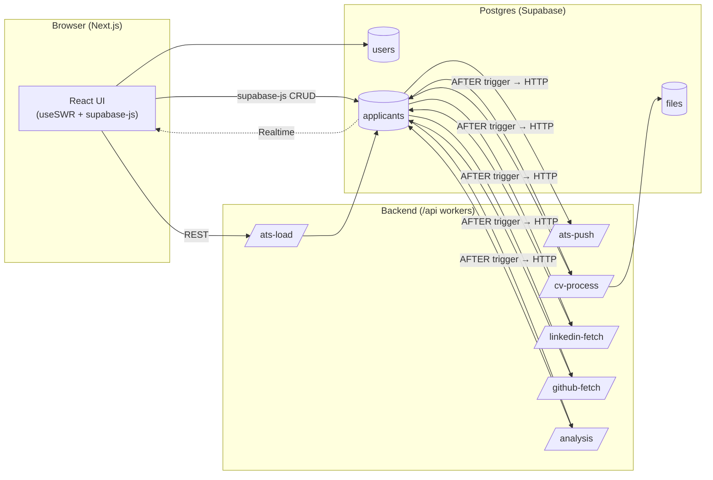
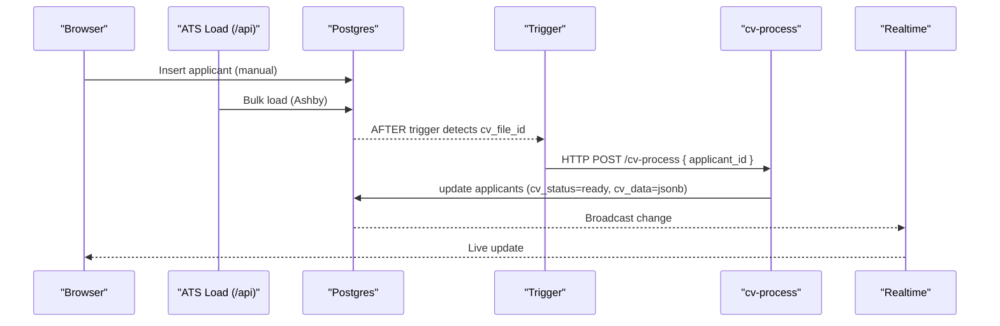

# System Architecture – Event-Driven with Generated Columns

> Next.js + Supabase where **Postgres is both the data store and the trigger switch**.  Lightweight CRUD travels directly from browser to DB under Row-Level Security (RLS).  Heavier enrichment jobs (CV parsing, LinkedIn scraping, GitHub stats, AI analysis) start automatically via Postgres `AFTER` triggers that call worker endpoints using `pg_net.http_post()`.  Generated columns ensure data consistency without drift.

---

## 1 Component View



**Key ideas**
1. Direct browser-to-DB CRUD keeps latency tiny.
2. Triggers hand-off expensive work to stateless workers through HTTP; no queue table.
3. `/api` handlers can later become Edge Functions or background jobs without schema changes.

---

## 2 Data Model (essentials)

| Table | Notes |
|-------|-------|
| `users` | Auth accounts (`id = auth.uid()`) + Ashby integration columns (`ashby_api_key`, `ashby_sync_cursor`, `ashby_features jsonb`) |
| `files` | Metadata for objects stored in Supabase Storage (`user_id FK`) |
| `applicants` | Single-row truth containing enrichment JSON + status columns (`user_id FK`) |

### `applicants` key columns

| Column | Purpose |
|--------|---------|
| `cv_file_id` | FK → `files.id` (original résumé) |
| `cv_status`  | `processing_status` enum: `pending` \| `processing` \| `ready` \| `error` \| `not_provided` |
| `cv_data`    | Parsed résumé (`jsonb`) |
| `li_status`  | LinkedIn scrape status (`processing_status` enum) |
| `li_data`    | LinkedIn snapshot (`jsonb`) |
| `gh_status`  | GitHub fetch status (`processing_status` enum) |
| `gh_data`    | GitHub stats (`jsonb`) |
| `ai_status`  | AI analysis status (`processing_status` enum) |
| `ai_data`    | AI verdict (`jsonb`) |
| `status`     | **Generated column**: `overall_status` enum derived from sub-statuses |
| `score`      | **Generated column**: `integer` extracted from `ai_data->>'score'` |
| `name`, `email`, `phone` | Scalar fields synced from JSON data via triggers |

> Generated columns eliminate data drift and ensure consistency. JSON columns remain schema-less for flexibility, but key fields are extracted to typed columns for indexing and queries.

---

## 3 Row-Level Security (RLS) & Auth

* Every table above carries a `user_id` column.
* Base policy (read/write own rows):

```sql
create policy tenant_isolation on applicants
  for all
  using  ( user_id = auth.uid() )
  with check ( user_id = auth.uid() );
```

* Browser uses `supabase-js` with the user’s JWT ➜ direct CRUD, no backend hop.
* Service-role keys in workers bypass RLS only when privileged writes are required (e.g. ATS bulk load).

---

## 4 Trigger-Driven Processing with pg_net

```sql
-- CV Processing Webhook (actual implementation)
CREATE OR REPLACE FUNCTION public.webhook_cv_processing()
RETURNS TRIGGER AS $$
BEGIN
  -- Trigger if cv_file_id is set and CV processing should start
  IF NEW.cv_file_id IS NOT NULL AND NEW.cv_status = 'pending' AND
     (TG_OP = 'INSERT' OR OLD.cv_file_id IS NULL OR OLD.cv_status = 'pending') THEN

    -- Update status to processing first
    UPDATE public.applicants
    SET cv_status = 'processing'::processing_status
    WHERE id = NEW.id;

    -- Fire webhook asynchronously using pg_net
    PERFORM net.http_post(
      url => 'http://host.docker.internal:3000/api/cv-process',
      body => jsonb_build_object(
        'type', 'CV_PROCESSING',
        'applicant_id', NEW.id,
        'file_id', NEW.cv_file_id
      ),
      headers => '{"Content-Type": "application/json"}'::jsonb,
      timeout_milliseconds => 3000
    );
  END IF;
  RETURN NEW;
END;
$$ LANGUAGE plpgsql SECURITY DEFINER;

CREATE TRIGGER webhook_cv_trigger
  AFTER INSERT OR UPDATE ON public.applicants
  FOR EACH ROW EXECUTE FUNCTION public.webhook_cv_processing();
```

**Key improvements over theoretical approach:**
- Uses real `pg_net` extension instead of `supabase_functions.http_request()`
- Updates status before firing webhook to prevent race conditions
- Handles both INSERT and UPDATE operations
- Uses proper development URLs (`host.docker.internal`)
- Includes error handling and timeouts

---

## 5 Applicant Ingestion Flow (happy path)



---

## 6 Worker Endpoints (Next.js /api or Edge Function)

| Method | Path | Purpose |
|--------|------|---------|
| `POST` | `/api/ats-load` | Import applicants from Ashby |
| `POST` | `/api/cv-process` | Parse résumé & update applicant row |
| `POST` | `/api/linkedin-fetch` | Scrape LinkedIn & update applicant row |
| `POST` | `/api/github-fetch` | Fetch GitHub stats & update applicant row |
| `POST` | `/api/analysis` | Run AI analysis & update applicant row |

These endpoints can later be migrated to Edge Functions or a queue worker without changing triggers.

---

## 7 Extending the System

### Adding New Processing Steps
1. **Add status column**: `ALTER TABLE applicants ADD COLUMN foo_status processing_status DEFAULT 'pending';`
2. **Add data column**: `ALTER TABLE applicants ADD COLUMN foo_data jsonb;`
3. **Update generated status logic**: Modify the `status` generated column expression
4. **Create webhook function**: Copy existing webhook pattern
5. **Create trigger**: `CREATE TRIGGER webhook_foo_trigger AFTER INSERT OR UPDATE...`
6. **Implement API route**: Create `/api/foo-process/route.ts`

### Generated Column Patterns
```sql
-- Status derived from sub-statuses
status overall_status GENERATED ALWAYS AS (
  CASE
    WHEN cv_status = 'error' OR li_status = 'error' THEN 'failed'::overall_status
    WHEN ai_status = 'ready' THEN 'completed'::overall_status
    WHEN cv_status = 'processing' THEN 'processing'::overall_status
    ELSE 'uploading'::overall_status
  END
) STORED,

-- Score extracted from JSON
score integer GENERATED ALWAYS AS (
  (ai_data->>'score')::integer
) STORED
```

### Development & Debugging
- **Monitor webhooks**: Query `net.http_request_queue` table
- **Test triggers**: Insert/update records and check webhook queue
- **Debug generated columns**: Select derived values after updates
- **Local development**: Use `host.docker.internal:3000` for webhook URLs

---

## 8 Reference

* Supabase Triggers – <https://supabase.com/docs/guides/database/postgres/triggers>
* Realtime (Postgres Changes) – <https://supabase.com/docs/guides/realtime/postgres-changes>
