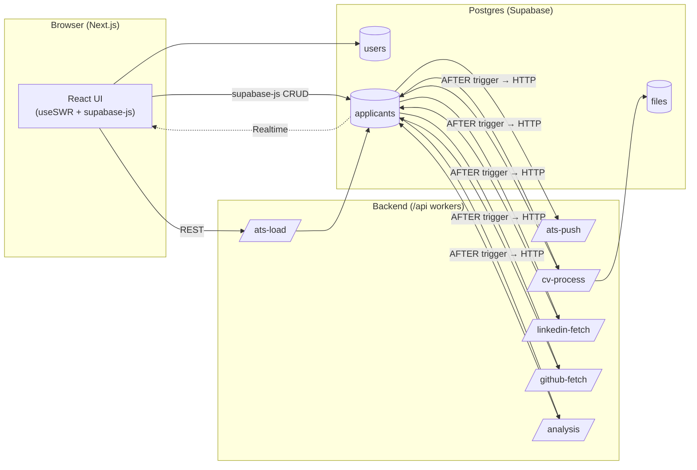

# System Architecture – Minimal, Event-Driven (Single-Row Applicant, No `event_log`)

> Next.js + Supabase where **Postgres is both the data store and the trigger switch**.  Lightweight CRUD travels directly from browser to DB under Row-Level Security (RLS).  Heavier enrichment jobs (CV parsing, LinkedIn scraping, GitHub stats, AI analysis) start automatically via Postgres `AFTER` triggers that call worker endpoints with `supabase_functions.http_request()`.  No intermediate queue table is required.

---

## 1 Component View



**Key ideas**
1. Direct browser-to-DB CRUD keeps latency tiny.
2. Triggers hand-off expensive work to stateless workers through HTTP; no queue table.
3. `/api` handlers can later become Edge Functions or background jobs without schema changes.

---

## 2 Data Model (essentials)

| Table | Notes |
|-------|-------|
| `users` | Auth accounts (`id = auth.uid()`) + Ashby integration columns (`ashby_api_key`, `ashby_sync_cursor`, `ashby_features jsonb`) |
| `files` | Metadata for objects stored in Supabase Storage (`user_id FK`) |
| `applicants` | Single-row truth containing enrichment JSON + status columns (`user_id FK`) |

### `applicants` key columns

| Column | Purpose |
|--------|---------|
| `cv_file_id` | FK → `files.id` (original résumé) |
| `cv_status`  | `pending` | `processing` | `ready` | `error` |
| `cv_data`    | Parsed résumé (`jsonb`) |
| `li_status`  | LinkedIn scrape status |
| `li_data`    | LinkedIn snapshot (`jsonb`) |
| `gh_status`  | GitHub fetch status |
| `gh_data`    | GitHub stats (`jsonb`) |
| `ai_status`  | AI analysis status |
| `ai_data`    | AI verdict (`jsonb`) |

> All JSON columns are **schema-less** because we never filter on them – only render or post-process.

---

## 3 Row-Level Security (RLS) & Auth

* Every table above carries a `user_id` column.
* Base policy (read/write own rows):

```sql
create policy tenant_isolation on applicants
  for all
  using  ( user_id = auth.uid() )
  with check ( user_id = auth.uid() );
```

* Browser uses `supabase-js` with the user’s JWT ➜ direct CRUD, no backend hop.
* Service-role keys in workers bypass RLS only when privileged writes are required (e.g. ATS bulk import).

---

## 4 Trigger-Driven Processing (no queue)

```sql
-- CV was just attached → fire HTTP job
after create or replace function on_cv_uploaded()
returns trigger language plpgsql as $$
declare
  hdr jsonb := jsonb_build_object('Content-Type','application/json');
begin
  if new.cv_file_id is not null and old.cv_file_id is null then
    perform supabase_functions.http_request(
      'https://YOUR_PROJECT.supabase.co/functions/v1/cv-process',
      'POST',
      hdr,
      jsonb_build_object('applicant_id', new.id)::text,
      1000  -- timeout ms
    );
    update applicants set cv_status = 'processing' where id = new.id;
  end if;
  return new;
end;
$$;

create trigger cv_trigger
  after update on applicants
  for each row execute function on_cv_uploaded();
```

Copy this function for LinkedIn (`li_status`), GitHub (`gh_status`) and AI (`ai_status`) with different URLs.

---

## 5 Applicant Ingestion Flow (happy path)


---

## 6 Worker Endpoints (Next.js /api or Edge Function)

| Method | Path | Purpose |
|--------|------|---------|
| `POST` | `/api/ats-sync` | Import applicants from Ashby |
| `POST` | `/api/cv-process` | Parse résumé & update applicant row |
| `POST` | `/api/linkedin-fetch` | Scrape LinkedIn & update applicant row |
| `POST` | `/api/github-fetch` | Fetch GitHub stats & update applicant row |
| `POST` | `/api/analysis` | Run AI analysis & update applicant row |

These endpoints can later be migrated to Edge Functions or a queue worker without changing triggers.

---

## 7 Extending the System

1. **Add new enrichment** → add `<foo>_status` & `<foo>_data` columns, copy trigger, create worker endpoint.
2. **Need scheduled work** → move handler into Edge Function + `cron`.
3. **Multi-tenant analytics** → query materialized views without touching JSON blobs.

---

## 8 Reference

* Supabase Triggers – <https://supabase.com/docs/guides/database/postgres/triggers>
* Realtime (Postgres Changes) – <https://supabase.com/docs/guides/realtime/postgres-changes>
