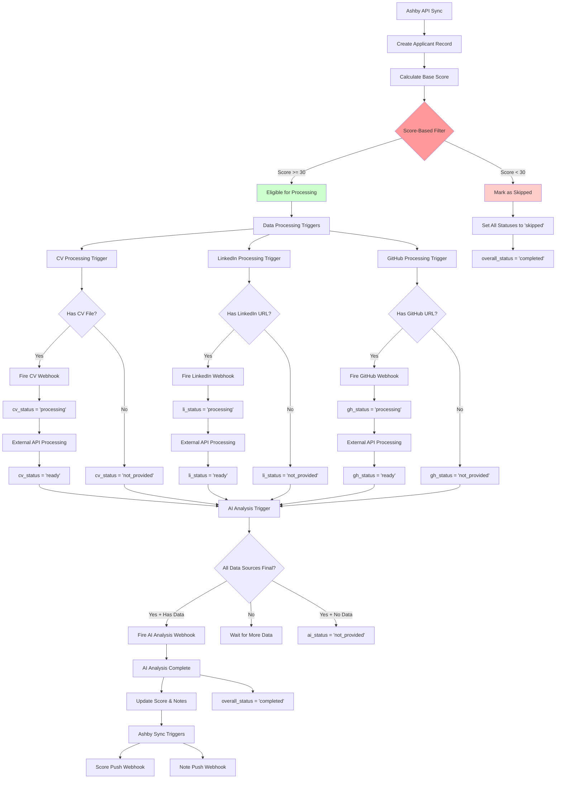
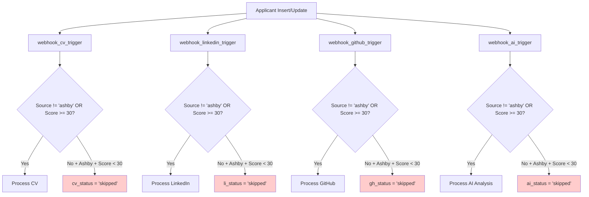
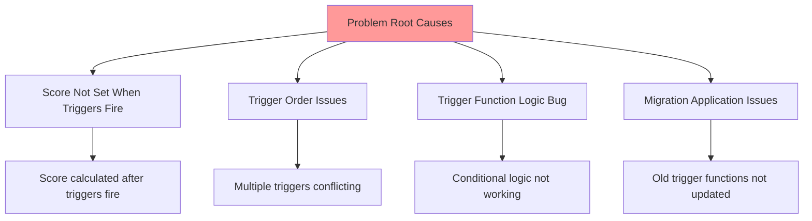

# Ashby Applicant Processing Flow

## System Architecture Overview



## Trigger System Detail

### Data Processing Triggers (Score-Based Filtering)



### Ashby Integration Triggers (Webhook Queue)

```mermaid
flowchart TD
    A[Score Updated] --> B[unified_ashby_score_trigger]
    C[Notes Updated] --> D[unified_ashby_note_trigger]
    
    B --> E{Score Change Significant?}
    D --> F{Notes Changed?}
    
    E -->|Yes| G[Queue Score Push Webhook]
    F -->|Yes| H[Queue Note Push Webhook]
    
    G --> I[webhook_queue Table]
    H --> I
    
    I --> J[pg_cron Job Every 2min]
    J --> K[/api/webhooks/process-queue]
    K --> L[Batch Process Queue]
    
    L --> M[Push Score to Ashby]
    L --> N[Push Note to Ashby]
    
    style G fill:#cceeff
    style H fill:#cceeff
```

## Current Issue Analysis

### Expected Behavior:
1. Ashby candidates with score < 30 should have statuses set to `'skipped'` by data processing triggers
2. Only candidates with score >= 30 should have `'pending'` → `'processing'` → `'ready'` flow

### Actual Behavior (Current):
- All candidates stuck at `'pending'` regardless of score
- No candidates showing `'skipped'` status
- Score-based filtering not working

### Potential Problems:



## Debug Steps Needed:

1. **Check trigger execution order**: Are scores available when data processing triggers fire?
2. **Verify trigger function code**: Are the updated functions with score filtering actually deployed?
3. **Test trigger logic**: Do the conditional statements work correctly?
4. **Check migration status**: Were all function updates applied successfully?
