# Ashby Applicant Processing Flow

## System Architecture Overview


## Trigger System Detail

### Data Processing Triggers (Fixed - WHEN Conditions + Function Logic)

```mermaid
flowchart TD
    A[Applicant Insert/Update] --> B[webhook_cv_trigger]
    A --> C[webhook_linkedin_trigger]
    A --> D[webhook_github_trigger] 
    A --> E[webhook_ai_trigger]
    
    B --> F[WHEN: cv_status='pending' AND cv_file_id EXISTS]
    C --> G[WHEN: li_status='pending' AND linkedin_url EXISTS]
    D --> H[WHEN: gh_status='pending' AND github_url EXISTS]
    E --> I[WHEN: ai_status='pending' AND data collection complete]
    
    F --> J{Function Logic: cv_status != 'processing' AND file changed?}
    G --> K{Function Logic: li_status != 'processing' AND URL changed?}
    H --> L{Function Logic: gh_status != 'processing' AND URL changed?}
    I --> M{Function Logic: All sources final?}
    
    J -->|✅ Yes| N[🔥 Fire CV Webhook]
    K -->|✅ Yes| O[🔥 Fire LinkedIn Webhook]
    L -->|✅ Yes| P[🔥 Fire GitHub Webhook]
    M -->|✅ Yes| Q[🔥 Fire AI Analysis Webhook]
    
    J -->|❌ No| R[Skip - Already Processing/No Change]
    K -->|❌ No| S[Skip - Already Processing/No Change]
    L -->|❌ No| T[Skip - Already Processing/No Change]
    M -->|❌ No| U[Skip - Not Ready Yet]
    
    style N fill:#ccffcc
    style O fill:#ccffcc
    style P fill:#ccffcc
    style Q fill:#ccffcc
    style R fill:#f0f0f0
    style S fill:#f0f0f0
    style T fill:#f0f0f0
    style U fill:#f0f0f0
```



### Ashby Integration (Manual Push Only)

```mermaid
flowchart TD
    A[UI: ATS Candidates Table] --> B[User Selects Candidates]
    B --> C[Batch Push Button]
    C --> D[/api/ashby/push-score]
    
    D --> E[Validate Applicant IDs]
    E --> F[Get Ashby API Key]
    F --> G[For Each Candidate]
    
    G --> H[Lookup Ashby ID]
    H --> I[Get Score from Analysis]
    I --> J[Push to Ashby Custom Field]
    
    J --> K[Success/Failure Response]
    K --> L[Update UI with Results]
    
    style D fill:#ccffcc
    style J fill:#ccffcc
```

## ✅ Issues Resolved (August 2025)

### **Problem: LinkedIn Processing Stuck at 'Pending'**
**Root Cause**: Webhook functions had missing conditional logic after consolidation
**Solution**: Restored essential conditions:
- `NEW.li_status != 'processing'` - Prevents duplicate webhook calls
- `(TG_OP = 'INSERT' OR OLD.linkedin_url IS DISTINCT FROM NEW.linkedin_url)` - Only fires on actual changes

### **Problem: pg_cron Queue System Not Working Locally**  
**Root Cause**: pg_cron extension not installed in local development
**Solution**: 
- pg_cron **IS available** in local Supabase
- Migration now auto-installs: `CREATE EXTENSION IF NOT EXISTS pg_cron;`
- Automatic queue processing every 2 minutes in both dev and production

### **Fixed Architecture**

```mermaid
flowchart TD
    A[✅ FIXED: Webhook Functions] --> B[Proper Conditional Logic]
    A --> C[Only Fire on Changes]
    A --> D[Respect Processing Status]
    
    E[✅ FIXED: pg_cron System] --> F[Auto-Install Extension]
    E --> G[Works in Local + Production]
    E --> H[Queue Processes Every 2min]
    
    I[✅ FIXED: Score-Based Filtering] --> J[Pre-set Status Logic]
    I --> K[base_score Column Added]
    I --> L[Simplified Architecture]
    
    style A fill:#ccffcc
    style E fill:#ccffcc
    style I fill:#ccffcc
```



## Current Status: System Working ✅

1. **Data Processing**: LinkedIn/CV/GitHub webhooks fire correctly
2. **Queue System**: pg_cron processes Ashby score/note pushes automatically  
3. **Score Filtering**: Low-score candidates get 'skipped' status as expected
4. **Local Development**: Full feature parity with production
