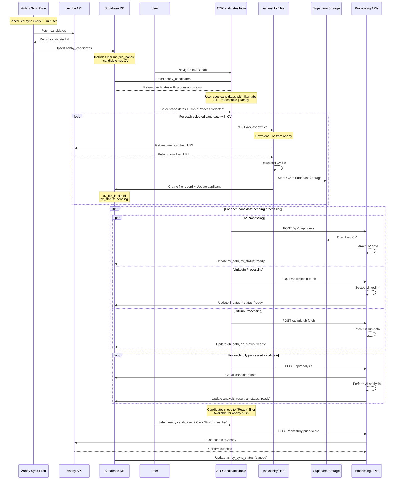

# ATS Upload Flow

**Added:** August 23, 2025 - Henry Allen  
**Purpose:** Documents the ATS candidate CV download and manual processing flow

## Flow Diagram

## Key Points

- **Manual Control**: All processing is user-initiated via "Process Selected" button
- **Batch Processing**: Multiple candidates can be processed simultaneously
- **Filter Tabs**: UI shows candidates by processing state (All/Processable/Ready)
- **CV Download**: ATS candidates' CVs are downloaded from Ashby on-demand
- **No Auto-Push**: Scores are only pushed to Ashby when user explicitly chooses
- **Status Tracking**: Each processing step updates specific status fields
