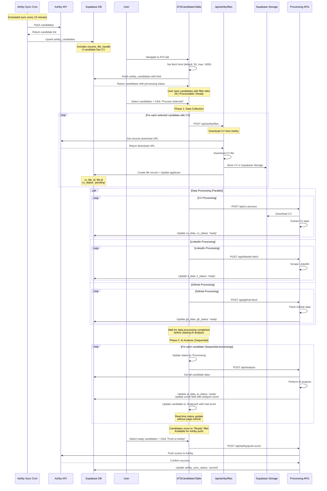

# ATS Upload Flow

**Added:** August 23, 2025 - Henry Allen  
**Purpose:** Documents the ATS candidate CV download and manual processing flow

## Flow Diagram

## Key Points

- **Manual Control**: All processing is user-initiated via "Process Selected" button
- **Sequential Processing**: Data collection (parallel) → AI analysis (sequential)
- **Batch Processing**: Multiple candidates can be processed simultaneously for data collection
- **Real-time UI Updates**: Individual candidate status updates without page refresh
- **Filter Tabs**: UI shows candidates by processing state (All/Processable/Ready)
- **Configurable Fetch Limit**: User can specify how many candidates to fetch from Ashby
- **CV Download**: ATS candidates' CVs are downloaded from Ashby on-demand
- **Score Persistence**: Analysis scores persist in database and across page refreshes
- **No Auto-Push**: Scores are only pushed to Ashby when user explicitly chooses
- **Status Tracking**: Each processing step updates specific status fields

## Recent Improvements (January 2025)

- **Fixed Double-Click Issue**: Resolved issue where AI analysis required two clicks to start
- **Sequential AI Processing**: AI analysis now runs sequentially after data collection completes
- **Eliminated Dashboard Flickering**: Individual candidate updates instead of full page refresh
- **Local State Tracking**: Prevents stale prop issues during batch processing
- **Functional State Updates**: Prevents React batching race conditions
- **Improved Status Progression**: Smooth transitions from "Not Processed" → "Processing" → "Analyzed"
- **Score Database Persistence**: AI analysis scores persist across page refreshes
