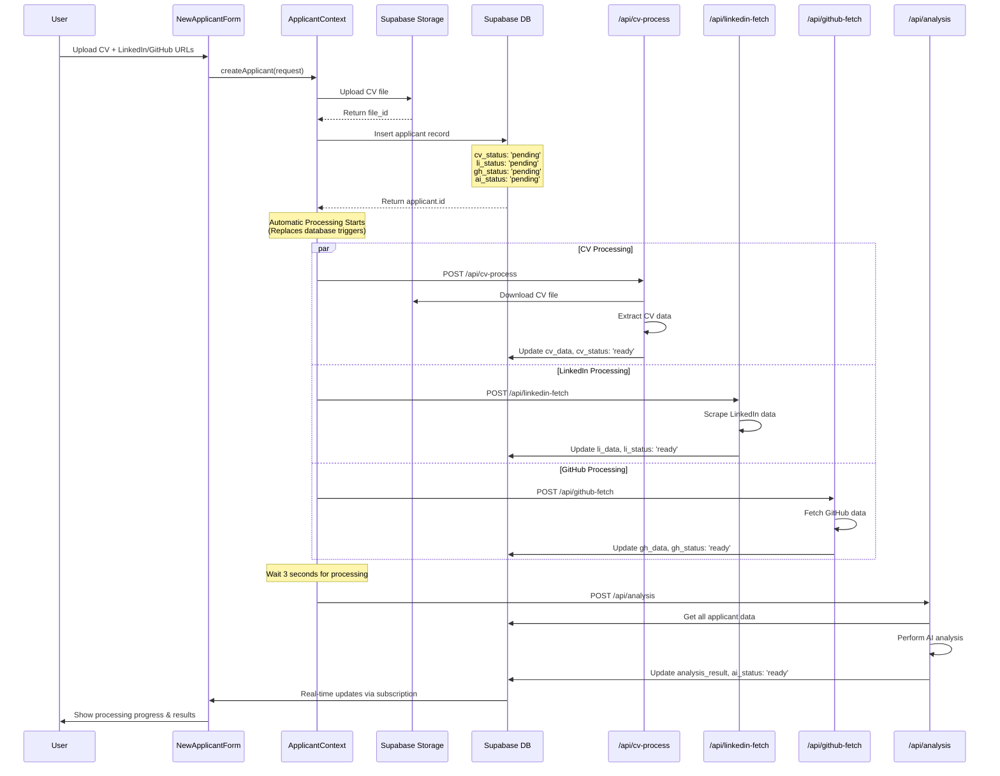

# Manual Upload Flow

**Added:** January 26, 2025  
**Purpose:** Documents the manual CV upload and processing flow after removing database triggers

## Flow Diagram

## Key Points

- **No Database Triggers**: Processing is initiated directly from the client context
- **Automatic Processing**: All data sources are processed immediately after applicant creation
- **Error Handling**: Each API call has individual error handling and logging
- **Real-time Updates**: UI updates automatically via Supabase real-time subscriptions
- **Separation**: Manual uploads are completely separate from ATS candidate processing
